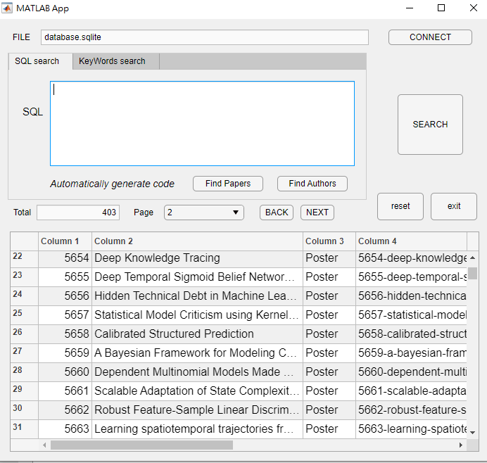
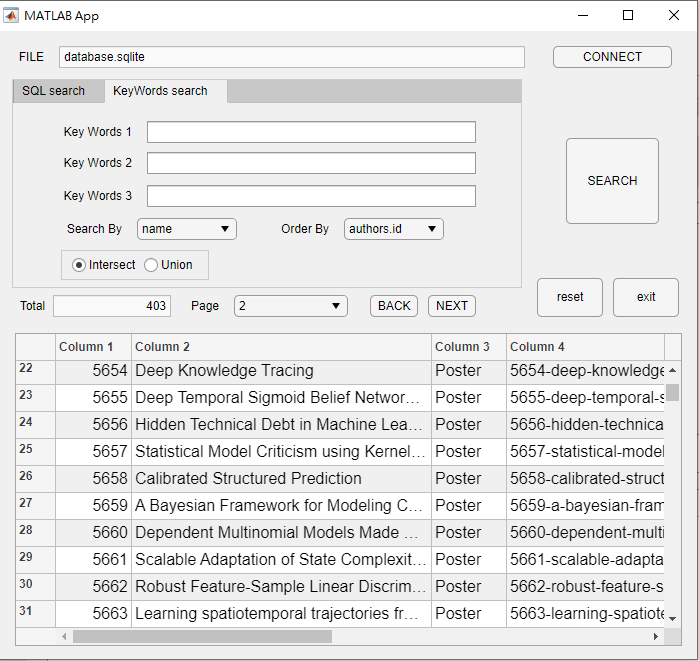
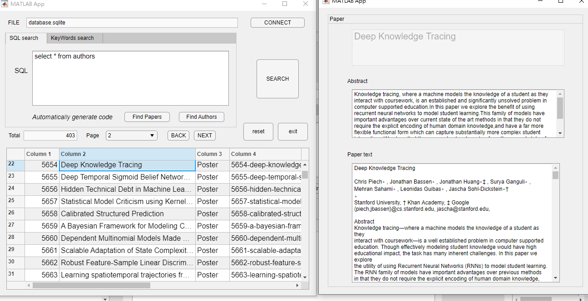

# MATLAB Database : A Demonstration of MATLAB APP Connecting with Database 

The main app file is "SQLAPP.mlapp", which you can directly execute, and you will see the GUI for SQL query to the demo database, database.sqlite.

First step for this app after executing is to click connectDB button, where you must have to change MATLAB direct to the loaction of database.sqlite.

By doing so, it will show the successful message box. Then, other SQL query you can do in the textbox, or keywords search in second page, as well.

By the way, click the table cell of your SQL query results, the GUI designed by "SQLAPP_2.mlapp" will jump up in the windows. It will display the details of what you click.

---

# Example

  

    
  

  

       
  
  

                  

       
  

